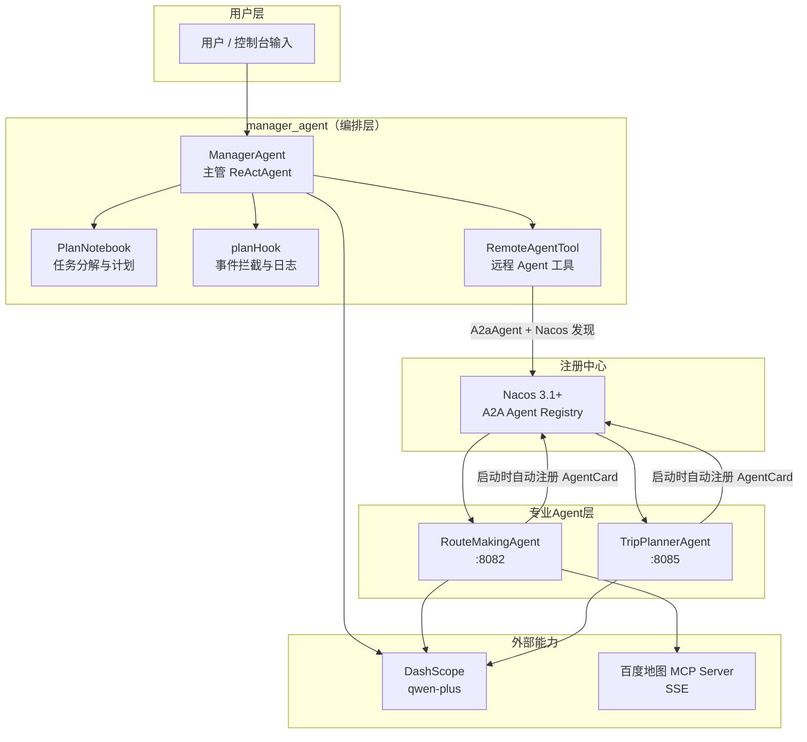
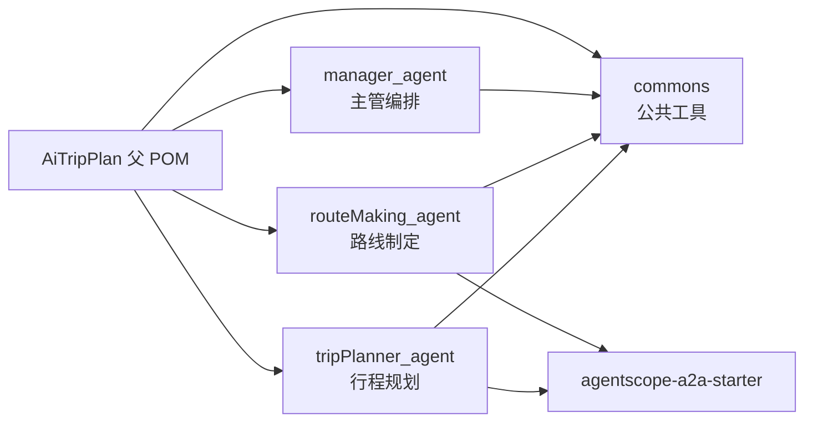
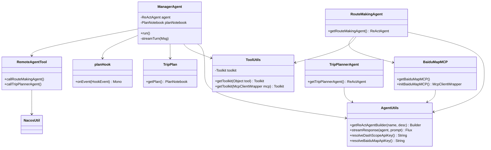

# TripPlanAgent 项目设计介绍

> 基于 AgentScope Java 的多智能体自驾游行程规划系统  
> 版本：1.0-SNAPSHOT | 技术栈：Java 17 + Spring Boot 4 + AgentScope 1.0.8

---

## 1. 项目概述

### 1.1 业务目标

本项目实现一个 **AI 驱动的自驾游行程规划系统**。用户输入旅游需求（如目的地、天数、偏好），系统通过多个专业化 Agent 协作，自动完成：

- 任务分解与计划制定
- 自驾路线规划（含地图能力）
- 景点行程规划
- 吃、住、行、天气等综合建议

### 1.2 核心设计理念

| 理念 | 说明 |
|------|------|
| **多 Agent 分工** | 主管 Agent 负责统筹，专业 Agent 负责路线/行程等垂直能力 |
| **Plan + ReAct** | 复杂任务先规划（PlanAct），再逐步推理执行（ReAct） |
| **Agent 即服务** | 子 Agent 以 Spring Boot 微服务形式独立部署，通过 A2A 协议对外暴露 |
| **注册发现** | 借助 Nacos 3.1+ 实现 Agent 注册与发现，支持动态调用 |
| **工具扩展** | 通过 MCP 协议接入百度地图等外部能力，通过 `@Tool` 封装远程 Agent |

---

## 2. 技术栈

| 类别 | 技术 | 版本 |
|------|------|------|
| 语言 | Java | 17 |
| 框架 | Spring Boot | 4.0.2 |
| Agent 框架 | AgentScope Java | 1.0.8 |
| 大模型 | 阿里云 DashScope（qwen-plus） | — |
| Agent 通信 | A2A（Agent-to-Agent）协议 | AgentScope 内置 |
| 服务注册 | Nacos A2A Registry | ≥ 3.1.0 |
| 地图能力 | 百度地图 MCP Server（SSE） | — |
| 响应式 | Project Reactor | AgentScope 内置 |
| 构建 | Maven 多模块 | — |

---

## 3. 系统架构

### 3.1 整体架构图



### 3.2 模块依赖关系



### 3.3 部署形态对比

| 模块 | 运行方式 | 端口 | 是否注册 Nacos |
|------|----------|------|----------------|
| `manager_agent` | 纯 Java `main()`，非 Spring Boot | — | 否（作为客户端调用） |
| `routeMaking_agent` | Spring Boot 常驻服务 | 8082 | 是 |
| `tripPlanner_agent` | Spring Boot 常驻服务 | 8085 | 是 |
| Nacos Server | 独立进程 standalone | 8848 | — |

---

## 4. 目录结构总览

```
AiTripPlan-AgentScope/
├── pom.xml                          # 父 POM
├── docs/
│   └── 项目设计文档.md               # 本文档
├── commons/                         # 公共模块
│   └── src/main/
│       ├── java/utils/
│       │   ├── AgentUtils.java      # Agent 构建与流式调用
│       │   ├── ToolUtils.java       # Toolkit 封装
│       │   └── NacosUtil.java       # Nacos 客户端
│       └── resources/
│           ├── .env                 # API 密钥
│           └── application.yml
├── manager_agent/                   # 主管编排（控制台）
│   └── src/main/java/managerAgent/
│       ├── ManagerAgentApplication.java
│       ├── agents/ManagerAgent.java
│       ├── plan/TripPlan.java
│       ├── hook/planHook.java
│       ├── tool/RemoteAgentTool.java
│       └── controller/AppController.java
├── routeMaking_agent/               # 路线 Agent（:8082）
│   └── src/main/java/routeMakingAgent/
│       ├── RouteMakingAgentApplication.java
│       ├── agents/RouteMakingAgent.java
│       └── mcp/BaiduMapMCP.java
└── tripPlanner_agent/             # 行程 Agent（:8085）
    └── src/main/java/tripPlannerAgent/
        ├── TripPlannerAgentApplication.java
        └── agents/TripPlannerAgent.java
```

---

## 5. 核心类关系图



---

## 6. 总结

本项目是一个 **多 Agent 协作系统**，核心设计思路可概括为：

> **一个主管 Agent（Plan + ReAct）+ 多个专业 Agent 微服务（A2A）+ 外部工具（MCP）+ 注册中心（Nacos）**

通过 AgentScope Java 框架，将大模型的推理能力、工具调用能力、任务规划能力、Agent 间通信能力整合在一起，构建了一个可扩展的 AI 旅游规划平台骨架。当前代码已完成架构搭建与核心链路打通，后续可在远程调用传参、Web 化交互、记忆持久化等方向继续演进。

---

*文档生成时间：2026-06-09*
