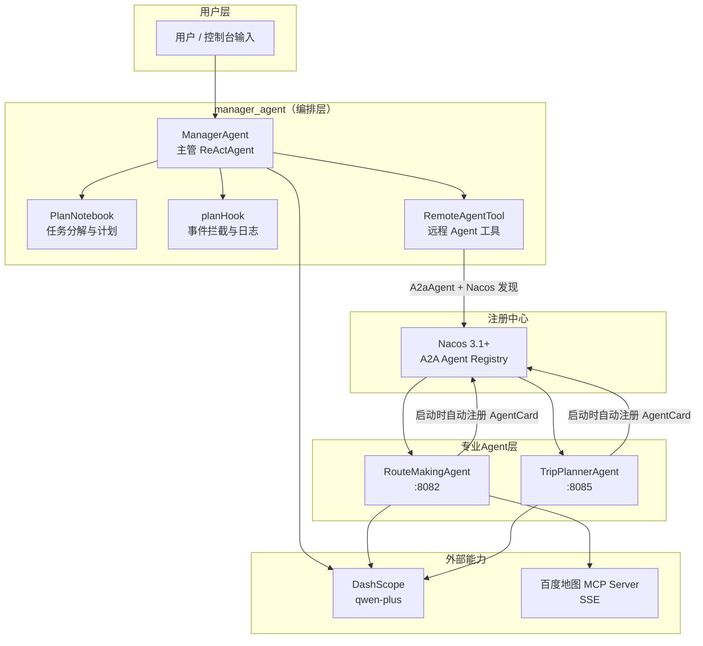
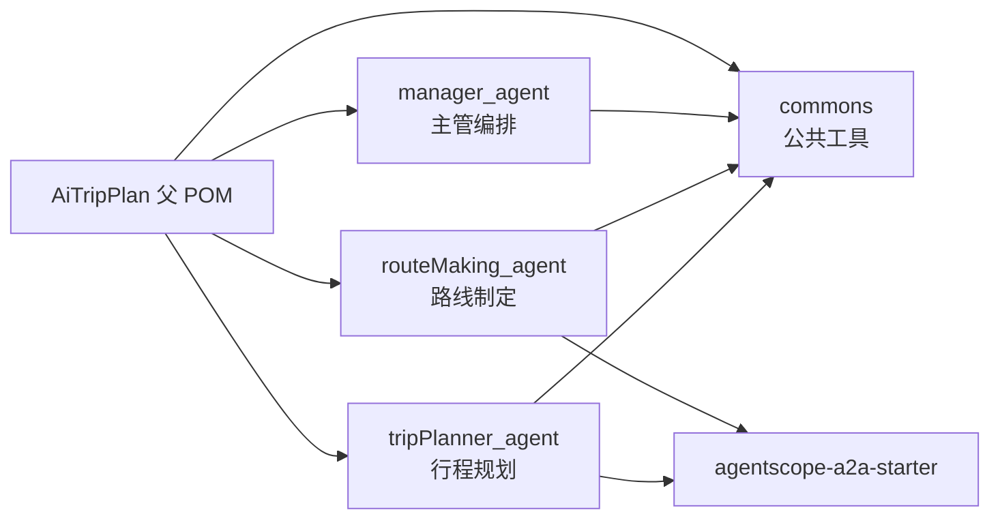
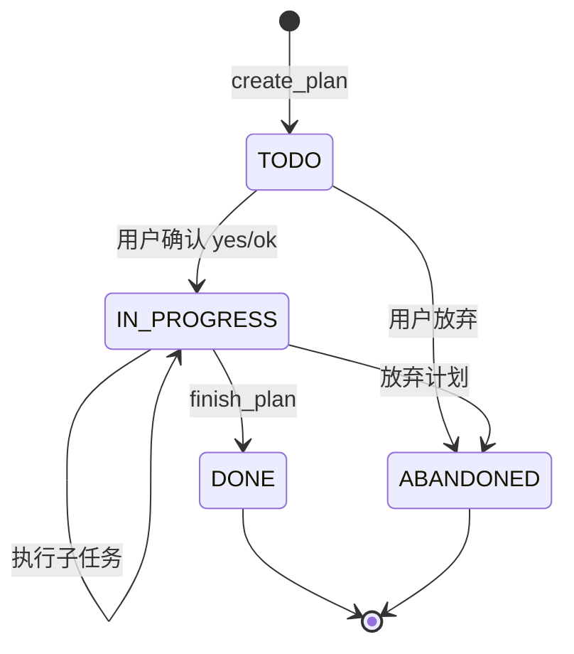
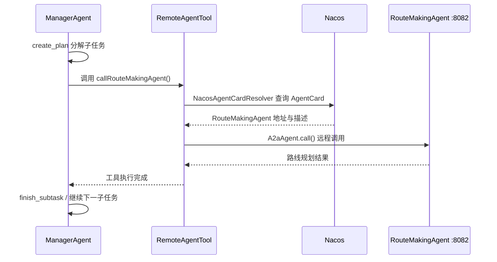
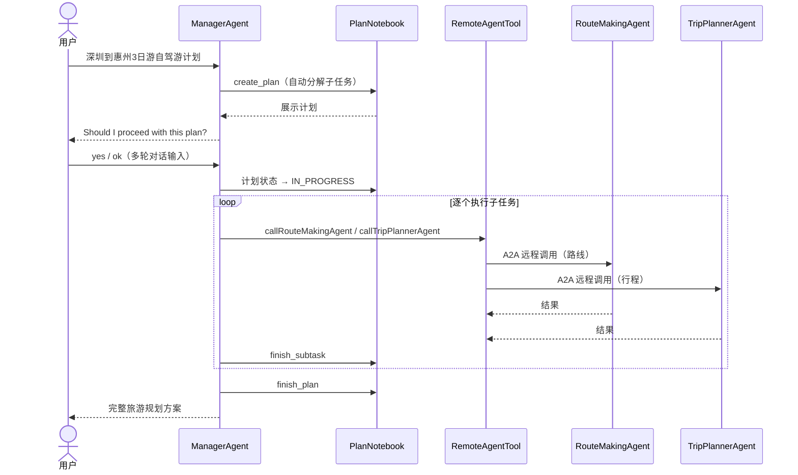

# AiTripPlan-AgentScope 项目设计文档

> 基于 AgentScope Java 的多智能体自驾游行程规划系统  
> 版本：1.0-SNAPSHOT | 技术栈：Java 17 + Spring Boot 4 + AgentScope 1.0.8

---

## 1. 项目概述

### 1.1 业务目标

本项目实现一个 **AI 驱动的自驾游行程规划系统**。用户输入旅游需求（如目的地、天数、偏好），系统通过多个专业化 Agent 协作，自动完成：

- 任务分解与计划制定
- 自驾路线规划（含地图能力）
- 景点行程规划
- 吃、住、行、天气等综合建议

### 1.2 核心设计理念

| 理念 | 说明 |
|------|------|
| **多 Agent 分工** | 主管 Agent 负责统筹，专业 Agent 负责路线/行程等垂直能力 |
| **Plan + ReAct** | 复杂任务先规划（PlanAct），再逐步推理执行（ReAct） |
| **Agent 即服务** | 子 Agent 以 Spring Boot 微服务形式独立部署，通过 A2A 协议对外暴露 |
| **注册发现** | 借助 Nacos 3.1+ 实现 Agent 注册与发现，支持动态调用 |
| **工具扩展** | 通过 MCP 协议接入百度地图等外部能力，通过 `@Tool` 封装远程 Agent |

---

## 2. 技术栈

| 类别 | 技术 | 版本 |
|------|------|------|
| 语言 | Java | 17 |
| 框架 | Spring Boot | 4.0.2 |
| Agent 框架 | AgentScope Java | 1.0.8 |
| 大模型 | 阿里云 DashScope（qwen-plus） | — |
| Agent 通信 | A2A（Agent-to-Agent）协议 | AgentScope 内置 |
| 服务注册 | Nacos A2A Registry | ≥ 3.1.0 |
| 地图能力 | 百度地图 MCP Server（SSE） | — |
| 响应式 | Project Reactor | AgentScope 内置 |
| 构建 | Maven 多模块 | — |

---

## 3. 系统架构

### 3.1 整体架构图



### 3.2 模块依赖关系



### 3.3 部署形态对比

| 模块 | 运行方式 | 端口 | 是否注册 Nacos |
|------|----------|------|----------------|
| `manager_agent` | 纯 Java `main()`，非 Spring Boot | — | 否（作为客户端调用） |
| `routeMaking_agent` | Spring Boot 常驻服务 | 8082 | 是 |
| `tripPlanner_agent` | Spring Boot 常驻服务 | 8085 | 是 |
| Nacos Server | 独立进程 standalone | 8848 | — |

---

## 4. Maven 模块说明

### 4.1 父模块 `AiTripPlan`

- **职责**：统一依赖版本管理、公共依赖声明
- **关键依赖**（所有子模块继承）：
  - `agentscope-spring-boot-starter`：AgentScope 与 Spring Boot 集成
  - `agentscope-nacos-spring-boot-starter`：Nacos A2A 注册/发现
  - `spring-boot-starter-web`：Web 容器（子 Agent 使用）
  - `logback-classic`：日志实现

### 4.2 公共模块 `commons`

- **职责**：抽取各 Agent 复用的工具类与配置
- **核心类**：

| 类 | 职责 |
|----|------|
| `AgentUtils` | 创建 `ReActAgent.Builder`、流式调用、API Key 解析 |
| `ToolUtils` | 封装 `Toolkit`，注册 `@Tool` 方法或 MCP 客户端 |
| `NacosUtil` | 创建 Nacos `AiService` 客户端（`localhost:8848`） |

- **配置**：`src/main/resources/.env` 存放密钥

```properties
ALIBABA_DASHSCOPE_API_KEY=sk-xxx
BAIDU_MAP_KEY=your_baidu_ak
```

### 4.3 主管模块 `manager_agent`

- **职责**：任务入口、计划编排、调度远程 Agent
- **运行模式**：控制台交互式程序（`@SpringBootApplication` 已注释）
- **包结构**：

```
managerAgent/
├── ManagerAgentApplication.java   # 入口，调用 ManagerAgent.run()
├── agents/
│   └── ManagerAgent.java          # 主管 Agent 组装与多轮对话
├── plan/
│   └── TripPlan.java              # PlanNotebook 自定义配置
├── hook/
│   └── planHook.java              # Hook 事件监听（日志）
├── tool/
│   └── RemoteAgentTool.java       # 远程 Agent 封装为 @Tool
└── controller/
    └── AppController.java         # REST 接口（预留，未启用 Spring Boot）
```

### 4.4 路线模块 `routeMaking_agent`

- **职责**：自驾游路线制定，集成百度地图 MCP
- **运行模式**：Spring Boot 常驻 + A2A Server + Nacos 自动注册
- **包结构**：

```
routeMakingAgent/
├── RouteMakingAgentApplication.java
├── agents/
│   └── RouteMakingAgent.java      # @Bean 注册 ReActAgent
└── mcp/
    └── BaiduMapMCP.java           # 百度地图 MCP 客户端封装
```

### 4.5 行程模块 `tripPlanner_agent`

- **职责**：景点行程规划
- **运行模式**：Spring Boot 常驻 + A2A Server + Nacos 自动注册
- **特点**：纯 LLM 能力，无额外工具挂载

---

## 5. 核心设计模式

### 5.1 ReActAgent（推理 + 行动）

所有 Agent 均基于 `ReActAgent`，遵循 **Reasoning → Acting → Observing** 循环：

1. 接收用户消息，LLM 推理下一步
2. 决定是否调用工具
3. 获取工具结果，继续推理直到给出最终回复

统一通过 `AgentUtils.getReActAgentBuilder()` 创建，保证模型、密钥配置一致：

```java
ReActAgent.builder()
    .name(name)
    .description(description)
    .model(DashScopeChatModel.builder()
        .apiKey(resolveDashScopeApiKey())
        .modelName("qwen-plus")
        .stream(true)
        .build())
```

### 5.2 PlanNotebook（PlanAct 规划）

仅 **主管 Agent** 启用 `PlanNotebook`，实现复杂任务的自主分解：

| 配置项 | 值 | 含义 |
|--------|-----|------|
| `needUserConfirm` | `true` | 创建计划后需用户确认才执行 |
| `maxSubtasks` | `5` | 最多分解 5 个子任务 |

**内置规划工具**（Agent 自动调用，无需手动编写）：

| 工具 | 用途 |
|------|------|
| `create_plan` | 创建计划与子任务列表 |
| `revise_current_plan` | 修订当前计划 |
| `update_subtask_state` | 更新子任务状态 |
| `finish_subtask` | 标记子任务完成 |
| `finish_plan` | 完成或放弃整个计划 |
| `view_subtasks` | 查看子任务详情 |

**计划状态流转**：



### 5.3 Hook 事件拦截

`planHook` 实现 `Hook` 接口，在 Agent 生命周期关键节点插入日志，**不修改业务逻辑**：

| 事件 | 触发时机 | 当前处理 |
|------|----------|----------|
| `PreReasoningEvent` | 推理前 | 打印用户 Prompt |
| `PostReasoningEvent` | 推理后 | 打印思考过程 |
| `PostActingEvent` | 工具调用后 | 打印工具名称 |

> 设计原则：Hook 只做观测（Observability），用户交互统一由 `ManagerAgent.run()` 的多轮循环负责。

### 5.4 Tool 工具封装

两种工具注册方式，均通过 `ToolUtils` 统一：

**方式一：Java 方法工具（`@Tool` 注解）**

```java
@Tool(description = "从Nacos注册中心获取路线制定Agent")
public void callRouteMakingAgent() { ... }
```

`ToolUtils.getToolkit(Object tool)` → `toolkit.registerTool(tool)` 自动扫描 `@Tool` 方法。

**方式二：MCP 远程工具**

```java
ToolUtils.getToolkit(McpClientWrapper mcp)` → `toolkit.registerMcpClient(mcp)`
```

将 MCP Server 暴露的全部工具（如地理编码、路线规划）批量注册到 Agent。

### 5.5 A2A 远程 Agent 调用

子 Agent 作为 **A2A Server** 对外暴露，主管通过 **A2A Client** 调用：



关键代码路径：

1. **服务方**：`routeMaking_agent` / `tripPlanner_agent` 启动时，由 `agentscope-a2a-spring-boot-starter` 自动将 `ReActAgent` 注册为 A2A 服务并写入 Nacos
2. **调用方**：`RemoteAgentTool` 通过 `NacosAgentCardResolver` 发现 Agent，构建 `A2aAgent` 发起远程调用

### 5.6 MCP 外部能力接入

`RouteMakingAgent` 通过 SSE 连接百度地图 MCP Server：

```
https://mcp.map.baidu.com/sse?ak={BAIDU_MAP_KEY}
```

`BaiduMapMCP` 封装了客户端生命周期：

1. `getBaiduMapMCP()` — 创建 `McpClientWrapper`（SSE 传输）
2. `initBaiduMapMCP()` — 初始化连接、拉取工具列表（双重检查锁保证单例初始化）

---

## 6. 关键业务流程

### 6.1 完整用户请求流程



### 6.2 主管 Agent 多轮对话设计

`ManagerAgent.run()` 采用 **多轮 `stream()` 循环**，解决 `needUserConfirm` 需要后续用户消息的问题：

```java
while (true) {
    streamTurn(userMsg);                          // 流式输出 Agent 响应

    Plan plan = planNotebook.getCurrentPlan();
    if (plan == null || DONE || ABANDONED) break; // 计划结束

    if (plan.getState() == IN_PROGRESS) {
        userMsg = "请继续执行计划的剩余子任务。";    // 自动推进
        continue;
    }

    // TODO 状态：等待用户确认或修改
    input = scanner.nextLine();
    userMsg = input;                              // 传给下一轮
}
```

| 计划状态 | 行为 |
|----------|------|
| `TODO` | 等待用户输入确认（yes/ok）或修改意见 |
| `IN_PROGRESS` | 自动发送继续执行指令 |
| `DONE` / `ABANDONED` | 退出循环 |

---

## 7. 配置说明

### 7.1 环境变量 / `.env`

| 变量 | 用途 | 配置位置 |
|------|------|----------|
| `ALIBABA_DASHSCOPE_API_KEY` | 通义千问 API 密钥 | `commons/src/main/resources/.env` |
| `BAIDU_MAP_KEY` | 百度地图 MCP AK | 同上 |

解析优先级：系统环境变量 > `.env` 文件。

### 7.2 子 Agent 服务配置

`routeMaking_agent` / `tripPlanner_agent` 的 `application.yml`：

```yaml
server:
  port: 8082  # routeMaking 为 8082，tripPlanner 为 8085

agentscope:
  a2a:
    server:
      enabled: true          # 启用 A2A Server
    nacos:
      server-addr: localhost:8848  # Nacos 注册中心地址
```

### 7.3 基础设施要求

| 组件 | 最低版本 | 端口 |
|------|----------|------|
| Nacos Server | 3.1.0（支持 A2A Agent Registry） | 8848, 9848, 9849 |
| JDK | 17 | — |

---

## 8. 启动顺序

```bash
# 1. 启动 Nacos（standalone 模式）
cd nacos-server-3.2.2/bin
startup.cmd -m standalone

# 2. 启动路线制定 Agent（需先配置 BAIDU_MAP_KEY）
# 运行 RouteMakingAgentApplication → 监听 8082，注册到 Nacos

# 3. 启动行程规划 Agent
# 运行 TripPlannerAgentApplication → 监听 8085，注册到 Nacos

# 4. 启动主管 Agent（控制台交互）
# 运行 ManagerAgentApplication → 输入旅游需求，确认计划
```

---

## 9. 设计亮点与权衡

### 9.1 亮点

1. **关注点分离**：主管负责编排，专业 Agent 负责垂直领域，符合微服务思想
2. **标准协议**：A2A 实现 Agent 互操作，MCP 实现工具互操作，Nacos 实现服务治理
3. **可观测性**：Hook 机制在不侵入业务的前提下记录推理与工具调用过程
4. **配置复用**：`commons` 模块统一 Agent 创建与密钥管理，降低重复代码
5. **人机协同**：`needUserConfirm` 让用户在计划执行前有机会审核和调整

### 9.2 当前局限

| 局限 | 说明 | 改进方向 |
|------|------|----------|
| 主管非 Spring Boot | `manager_agent` 未启用 Web 服务，`AppController` 未生效 | 启用 `@SpringBootApplication`，提供 HTTP/SSE 接口 |
| 远程调用无上下文 | `RemoteAgentTool` 调用子 Agent 时未传递用户 Prompt | `agent.call(Msg)` 传入具体子任务描述 |
| Nacos 地址硬编码 | `NacosUtil` 写死 `localhost:8848` | 改为配置文件或环境变量 |
| 单次工具调用 | 远程 Agent `agent.call().block()` 无参数 | 根据子任务动态构造消息 |
| 无持久化记忆 | 各 Agent 无跨会话 Memory | 引入 `Session` / 数据库存储对话历史 |

---

## 10. 目录结构总览

```
AiTripPlan-AgentScope/
├── pom.xml                          # 父 POM
├── docs/
│   └── 项目设计文档.md               # 本文档
├── commons/                         # 公共模块
│   └── src/main/
│       ├── java/utils/
│       │   ├── AgentUtils.java      # Agent 构建与流式调用
│       │   ├── ToolUtils.java       # Toolkit 封装
│       │   └── NacosUtil.java       # Nacos 客户端
│       └── resources/
│           ├── .env                 # API 密钥
│           └── application.yml
├── manager_agent/                   # 主管编排（控制台）
│   └── src/main/java/managerAgent/
│       ├── ManagerAgentApplication.java
│       ├── agents/ManagerAgent.java
│       ├── plan/TripPlan.java
│       ├── hook/planHook.java
│       ├── tool/RemoteAgentTool.java
│       └── controller/AppController.java
├── routeMaking_agent/               # 路线 Agent（:8082）
│   └── src/main/java/routeMakingAgent/
│       ├── RouteMakingAgentApplication.java
│       ├── agents/RouteMakingAgent.java
│       └── mcp/BaiduMapMCP.java
└── tripPlanner_agent/             # 行程 Agent（:8085）
    └── src/main/java/tripPlannerAgent/
        ├── TripPlannerAgentApplication.java
        └── agents/TripPlannerAgent.java
```

---

## 11. 核心类关系图


---

## 12. 总结

本项目是一个 **多 Agent 协作系统**，核心设计思路可概括为：

> **一个主管 Agent（Plan + ReAct）+ 多个专业 Agent 微服务（A2A）+ 外部工具（MCP）+ 注册中心（Nacos）**

通过 AgentScope Java 框架，将大模型的推理能力、工具调用能力、任务规划能力、Agent 间通信能力整合在一起，构建了一个可扩展的 AI 旅游规划平台骨架。当前代码已完成架构搭建与核心链路打通，后续可在远程调用传参、Web 化交互、记忆持久化等方向继续演进。

---

*文档生成时间：2026-06-09*
